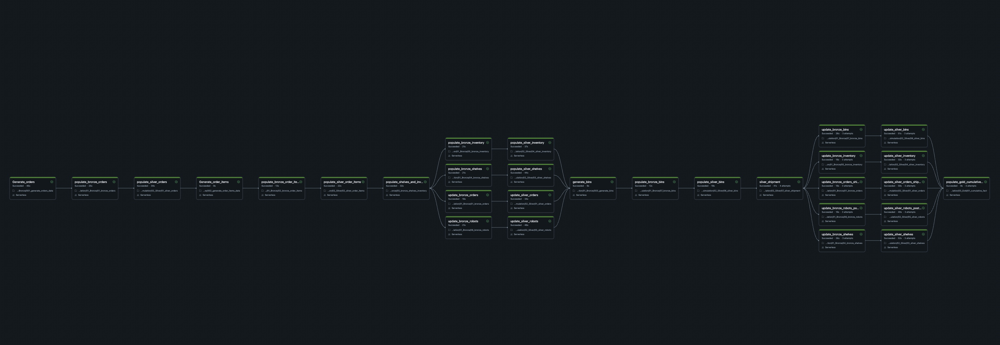
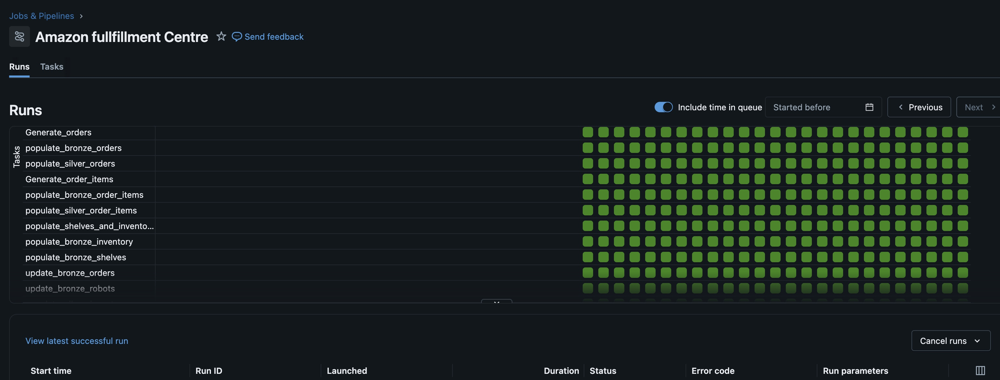
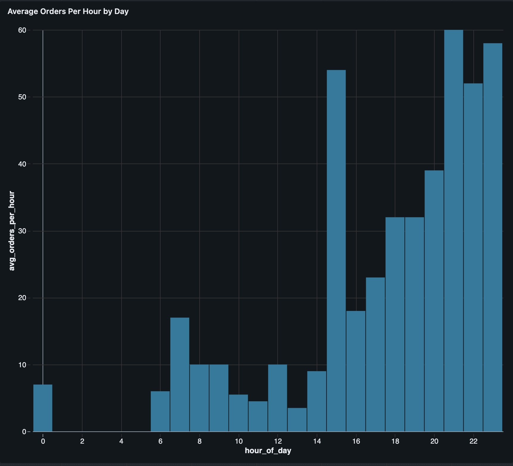
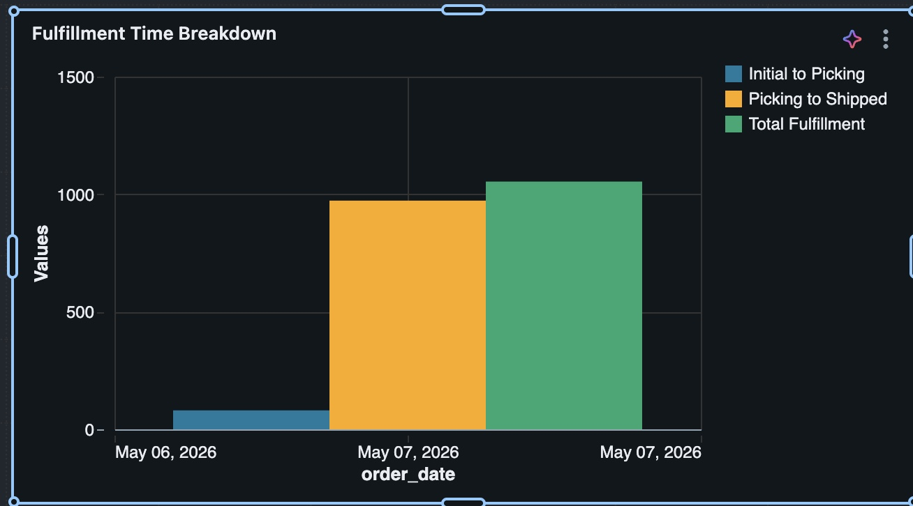
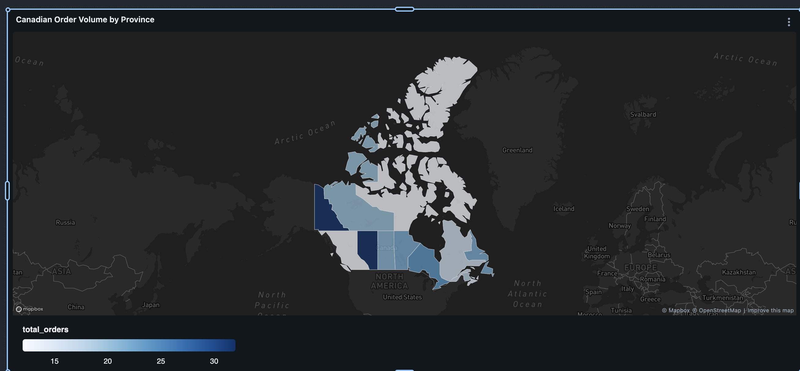

# amazon-fulfillment-databricks-simulation

# Architecting a Real-Time Medallion Pipeline for Warehouse Operations

# Project Inspiration

Inspired by a tour of an Amazon Fulfillment Center, this project simulates the high-velocity data lifecycle of automated inventory movement, robotic picking, and order shipment. The goal was to build a robust Medallion Architecture that handles state changes and provides real-time visibility into warehouse bottlenecks.


# Technical Stack
- Language: Python (PySpark), SQL
- Platform: Databricks, Unity Catalog
- Storage: Delta Lake (SCD Type 1 & 2)
- Orchestration: Databricks Workflows (Cron-scheduled)
- Schema Design: Star Schema with Cumulative Snapshot Fact tables

# Data Engineering Pipeline
1. Bronze (Ingestion)
- Implemented Auto Loader to incrementally ingest raw CSVs from cloud storage.
- Schema evolution was enabled to handle potential upstream data changes.

2. Silver (Transformation)
- State Management: Utilized SCD Type 2 for robots and employees to track historical status changes (e.g., Idle -> Picking -> Charging).
- Deduplication: Ensured "Exactly-once" semantics by deduplicating event streams using watermarking.

3. Gold (Analytics & Business Logic)
- Cumulative Snapshot Fact: Built a fact_order_lifecycle table. This allows the business to measure "Time-to-Ship" by tracking timestamps for Initial, Picking, and Shipped milestones in a single row.
- Periodic Snapshot Fact: Created a daily volume table aggregated by Geography and Time to monitor regional throughput.
- Optimization: Implemented Liquid Clustering on order_id and date_key to ensure high-performance joins and fast "Change Data Feed" (CDF) reads.


# The Data Challenge (Simulation)
To mirror real-world variability, I developed a custom data generator that:
- Produces dynamic order volumes based on "Time of Day" (e.g., peak afternoon surges vs. midnight lulls).
- Simulates robot telemetry (battery life, weight capacity) and employee availability constraints.
- Generates raw event streams in CSV format stored in cloud volumes.


# Data Modeling Strategy

Layered Architecture
- Bronze: Ingests raw CSV data from Cloud Volumes using Databricks Auto Loader. These tables act as the "Source of Truth" with minimal transformation.
- Silver: Applies schema enforcement and data cleaning.
    - SCD Type 1: Used for products and addresses where only the latest state is required.
    - SCD Type 2 / Versioning: Used for robots and bins to track status transitions (e.g., Picking to Idle) over time.
- Gold (Star Schema):
    - fact_order_lifecycle: A cumulative fact table that flattens the order journey. It allows for high-speed "Time-to-Ship" analysis.
    - fact_daily_order_volume: An aggregated periodic snapshot. It joins five Silver tables to provide a high-level view of regional throughput without the overhead of scanning millions of individual order rows.

The Markdown:
```mermaid
    graph LR
    subgraph Bronze [Raw / Ingestion]
        B1[addresses]
        B2[bin_events]
        B3[customers]
        B4[employee]
        B5[inventory]
        B6[order_items]
        B7[orders]
        B8[products]
        B9[robot_events]
        B10[shelves_events]
    end

    subgraph Silver [Cleaned / Filtered]
        S1[Address_silver]
        S2[bins]
        S3[customer_silver]
        S4[employee_silver]
        S5[inventory_silver]
        S6[order_items_silver]
        S7[orders_silver]
        S8[Products_silver]
        S9[robots]
        S10[shelves]
    end

    subgraph Gold [Curated / Analytics]
        G1[dim_date]
        G2[dim_geography]
        G3[fact_daily_order_volume]
        G4[fact_order_lifecycle]
    end

    Bronze --> Silver
    S1 --> G2
    S7 --> G4
    S7 & S6 & S3 & S1 & G2 --> G3

erDiagram
    DIM_DATE {
        int date_key PK
        date full_date
        int year
        int month
    }
    DIM_GEOGRAPHY {
        long geo_key PK
        string city
        string province
    }
    FACT_ORDER_LIFECYCLE {
        string order_id PK
        int date_key FK
        timestamp date_initial
        timestamp date_shipped
        string current_status
    }
    FACT_DAILY_ORDER_VOLUME {
        int date_key FK
        long geo_key FK
        int total_orders
        int total_items
    }

    DIM_DATE ||--o{ FACT_ORDER_LIFECYCLE : "tracks"
    DIM_DATE ||--o{ FACT_DAILY_ORDER_VOLUME : "aggregates"
    DIM_GEOGRAPHY ||--o{ FACT_DAILY_ORDER_VOLUME : "locates"

```

# Orchestration & Monitoring
The image of the Job:



The image of multiple successful runs:



# Showcasing some results

- Chart showing the average order placement per hour



- Chart showing the orders fullfillment breakdown



- Map of Canada showing the location where the orders have been placed.



